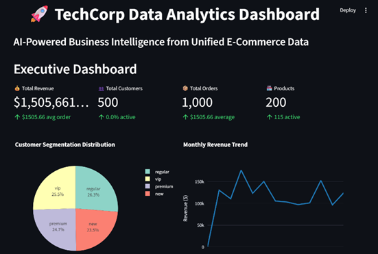
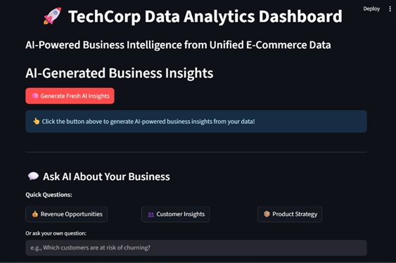
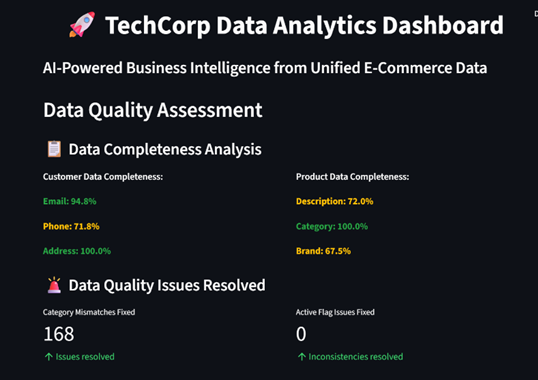

# QuantifAI Data Engineering Challenge

A comprehensive data engineering solution that transforms messy, inconsistent e-commerce data from three acquired platforms into a unified, normalized database with interactive business insights.

## 📖 **IMPORTANT: Read This First**

**📄 `documentation.docx`** - This is the **main comprehensive documentation** that contains:
- Complete thought process and methodology
- Detailed analysis of each dataset and quality issues
- Step-by-step cleaning strategies and reasoning
- Database design decisions and ER modeling
- Challenges faced and solutions implemented
- Business insights and technical decisions

**Please review the `documentation.docx` file for the complete project explanation before exploring the code.**

## 🎯 Project Overview

This project tackles real-world data engineering challenges by:
- **Extracting** data from multiple inconsistent sources
- **Transforming** messy, unstructured data with various quality issues
- **Loading** cleaned data into a normalized SQLite database  
- **Analyzing** data to provide actionable business insights through an interactive dashboard

## ✨ Key Features

- **Intelligent Data Profiling**: Automated analysis of data quality issues
- **Robust ETL Pipeline**: Handles multiple data inconsistencies and edge cases
- **Normalized Database Design**: Properly structured with relationships and constraints
- **Interactive Dashboard**: Streamlit-based UI with business insights and AI-powered analysis
- **Comprehensive Documentation**: Detailed reports on data quality and cleaning processes

## 🏗️ Project Architecture

```
QUANTIFAI/
├── 📄 documentation.docx            # ⭐ MAIN DOCUMENTATION - READ FIRST
├── 📊 app/                          # Streamlit dashboard application
├── 🧹 cleaned/                      # Processed, clean datasets
├── 🔧 cleaners/                     # Data cleaning scripts
├── 📁 Data/                         # Raw datasets and profiling results
├── 🗄️ db/                           # Database schema and insertion scripts
├── 📓 notebooks/                    # Jupyter analysis notebooks
├── 📋 reports/                      # Data quality assessment reports (PDF)
├── 🛠️ utils/                        # Utility functions and profiling tools
├── 🗃️ ecommerce.db                  # Final normalized SQLite database
└── 📄 requirements.txt              # Project dependencies
```

## 🚀 Quick Start

### Prerequisites
- Python 3.7+ installed
- Virtual environment (recommended)

### Installation

1. **Clone the repository**
   ```bash
   git clone https://github.com/VallabhSangvikar/QuantifAI-assignment.git
   cd QUANTIFAI-assignment
   ```

2. **Create and activate virtual environment**
   ```bash
   python -m venv venv
   
   # On Windows
   venv\Scripts\activate
   
   # On macOS/Linux
   source venv/bin/activate
   ```

3. **Install dependencies**
   ```bash
   pip install -r requirements.txt
   ```

4. **Set up environment variables**
   ```bash
   # Create a .env file or set environment variable
   export GOOGLE_API_KEY="your_gemini_api_key_here"
   ```

## 📋 Step-by-Step Execution

### Step 1: Data Analysis & Profiling
```bash
# Run the Jupyter notebook for data exploration and profiling
jupyter notebook notebooks/llm_validation.ipynb
```
This will:
- Analyze raw datasets for quality issues and use LLMs to find out the issues.
- Generate comprehensive PDF reports in `reports/` directory
- Create profiling summaries

### Step 2: Data Cleaning
Run the cleaning scripts in order:
```bash
python cleaners/clean_customers.py
python cleaners/clean_orders.py  
python cleaners/clean_products.py
```
**Verify**: Check that cleaned files appear in the `cleaned/` directory

### Step 3: Database Setup
```bash
# Create database schema
python db/create_tables.py

# Insert cleaned data
python db/insert_cleaned_data.py
```
**Verify**: Confirm `ecommerce.db` file is created in the root directory

### Step 4: Launch Dashboard
```bash
# Navigate to app directory and run dashboard
cd app
streamlit run dashboard.py
```

### Step 5: Explore the Dashboard
- **Data Overview**: Explore different dataset summaries and statistics
- **Business Analytics**: View key metrics and visualizations
- **AI-Powered Insights**: Get intelligent analysis of your data
- **Interactive Q&A**: Ask custom questions about the data using AI
- **Data Quality Metrics**: Review cleaning results and improvements

# 📊 Dashboard Features
**Core Analytics**

- KPIs Dashboard: Total Revenue, Orders, Customers, Product Counts with revenue trends and customer segmentation
- Customer Analytics: Status distribution, segment spending, geographic spread
- Product Analytics: Top products, price/stock distribution, category performance
- Raw Data Explorer: Direct table access for all database entities

# AI-Driven Insights

- LangChain + Gemini-2.0 Flash: AI-powered trend analysis and risk identification
- Interactive Q&A: Business questions with structured prompts
- Smart Recommendations: Customer segmentation and product optimization suggestions

## 🛠️ Technical Stack

- **Python**: Core programming language
- **Pandas**: Data manipulation and analysis
- **SQLite**: Database storage
- **Streamlit**: Interactive web dashboard
- **Jupyter**: Data exploration and analysis
- **Google Gemini AI**: Intelligent data analysis
- **Matplotlib/Plotly**: Data visualization

## 📁 File Descriptions

| File/Directory | Purpose |
|---------------|---------|
| **`documentation.docx`** | **📄 Complete project documentation with methodology and analysis** |
| `cleaners/` | Individual cleaning scripts for each dataset |
| `db/create_tables.py` | Database schema creation |
| `db/insert_cleaned_data.py` | Data insertion with validation |
| `app/dashboard.py` | Main Streamlit dashboard application |
| `utils/summarise.py` | Data summarise and quality assessment |
| `reports/` | Generated PDF reports on data quality |
| `notebooks/` | Jupyter notebooks for analysis and validation |

## 🤝 Project Documentation

This project includes comprehensive documentation:

- **`documentation.docx`**: Main project documentation with complete methodology, analysis, and technical decisions
- **`reports/`**: Individual PDF reports for each dataset's quality assessment  
- **Jupyter notebooks**: Interactive analysis and validation processes
- **This README**: Quick start guide and project overview

The `documentation.docx` file contains the detailed thought process behind every technical decision and should be reviewed to understand the complete solution approach.


## 📷 Few Dashboard Screenshots  

### Main Dashboard


### AI-Powered Insights


### Data Quality Metrics



